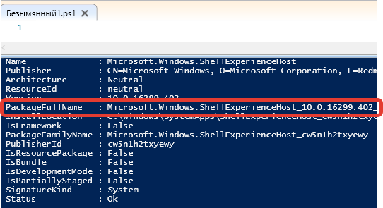

Windows 10 поставляется с большим количеством "лишнего" софта который мною не используется, но занимает место, сокращает длительность жизни SSD и вобще мазолит мне глаза. Поэтому, при отсутсвии предвартиельно подготовленого образа ОС, после установки приходится всю эту муть удалять. Поскольку я давний последователь использования командной строки, то для меня естественно использовать PowerShell.

Приложения из Магазина, или "Универсальные приложения Windpws" (UWP) поставляются в виде пакетов Appx и  в состав PowerShell уже включен модуль Appx с командлетами для работы с ними. Описание и перечень можно посмотреть [здесь](https://technet.microsoft.com/ru-ru/library/dn448373.aspx).

|Cmdlet	|Description|
|:-----|:-----|
|Add-AppxPackage| Adds a signed app package to a user account.|
|Add-AppxVolume|Adds an appx volume to the Package Manager.|
|Dismount-AppxVolume|Dismounts an appx volume.|
|Get-AppxDefaultVolume|Gets the default appx volume.|
|Get-AppxLastError|Get the last error reported in the app package installation logs.|
|Get-AppxLog||Gets an app package installation log.|
|Get-AppxPackage|Gets a list of the app packages that are installed in a user profile.|
|Get-AppxPackageManifest|Gets the manifest of an app package.|
|Get-AppxVolume|Gets appx volumes for the computer.|
|Mount-AppxVolume|Mounts an appx volume.|
|Move-AppxPackage|Moves a package from its current location to another appx volume.|
|Remove-AppxPackage|Removes an app package from a user account.|
|Remove-AppxVolume|Removes an appx volume.|
|Set-AppxDefaultVolume|Specifies a default appx volume.|

Для решения текущей задачи мы будем использовать не все из них.
1. Получить список приложений UWP в системе можно командлетом
> Get-AppxPackage

У этого командлета имеются параметры позволяющие указать интересующую область - Все пользователи, Какой-то определенный пользователь системы или текущийпользователь, -AllUsers; -User test_name; Без параметров, соответсвенно. 

2. Получив список пакетов, можем вручную удалять каждый по его имени в свойсте FullPackageName объекта.

> Remove-AppxPackage Microsoft.Windows.ShellExperienceHost_10.0.16299.402_neutral_neutral_cw5n1h2txyewy
Но это ужасно неудобно вручную делать, только если нужно удалить конкретный пакет.

3. В моём же случае нужно снести сразу все для всех пользователей и не мучаться, поэтому используею конвейер:
> Get-AppxPackage -AllUsers | Remove-AppxPackage

4. Чтобы один раз выполнить настройку и для каждого нового пользвоателя на машине не удалять приложения, удаляем из профиля по-умолчанию:
> Get-AppXProvisionedPackage -online | Remove-AppxProvisionedPackage -online

5. Если же стоит задача подготовить установочный образ и он смонтирован на жестком диске, то помогут командлеты
NaNundefinedGet-AppXProvisionedPackage –Path D:\OfflineImage | Remove-AppxProvisionedPackage –Path d:\OfflineImage