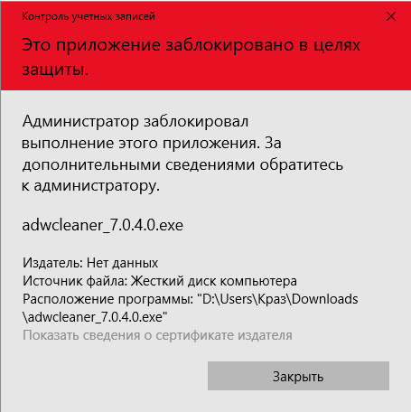

Система защиты Windows при всей своей неэффективности в то же время достаточно сложна и эшелонирована. Так элементы обеспечения безопасности Defender и UAC, который кстати раньше обозначался как  Limited User Account (LUA), способны работать в связке. Приводя к блокировке потенциально опасных для системы приложений. Вот и я столкнулся с этим, при том что и UAC и Defender я старательно отключил, приложение было блокировано из-за сертификата издателю которого система не доверяет. При этом использование функции "Запуск от имени администратора" привело к повторному появлению указанного окна.

Удалось запустить исполняемый файл из командной консоли, которая в свою очередь и была запущена от имени Администратора. Но это не очень удобно. Ниже представлен Powershell скрипт вносящий изменения в ветку реестра

HKEY_LOCAL_MACHINE\SOFTWARE\Microsoft\Windows\CurrentVersion\Policies\ System\EnableLUA

для отключения функционала ограниченного пользовательского аккаунта (LUA). Естественно при отключении еще одного средства защиты система становится ещё более подверженной вторжению.

<#

Отключает LUA

#>

$RegPath = "HKLM:\SOFTWARE\Microsoft\Windows\CurrentVersion\Policies\System"

$RegProperty = "EnableLUA"

Set-ItemProperty -path $RegPath -Name $RegProperty -value "0"

<#

Включает LUA

#>

$RegPath = "HKLM:\SOFTWARE\Microsoft\Windows\CurrentVersion\Policies\System"

$RegProperty = "EnableLUA"

Set-ItemProperty -path $RegPath -Name $RegProperty -value "1"