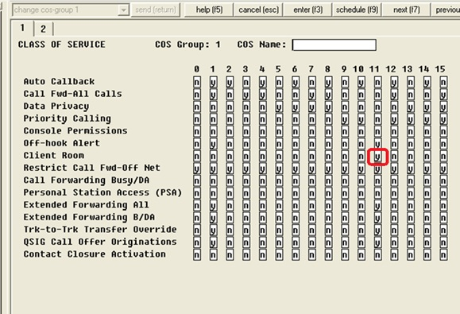
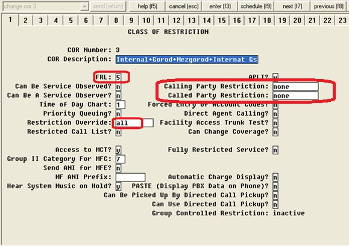
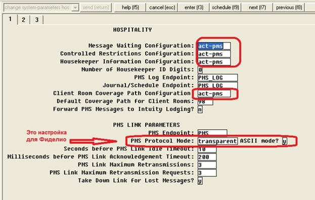
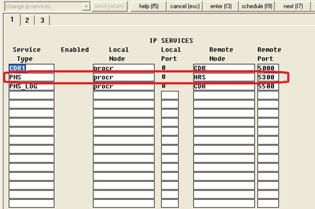
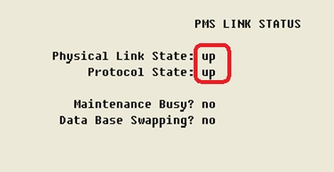
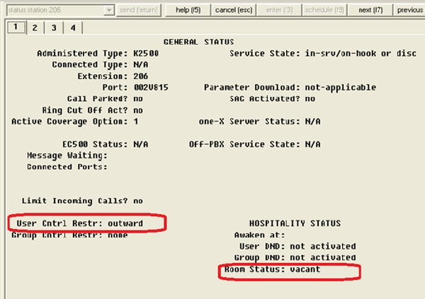
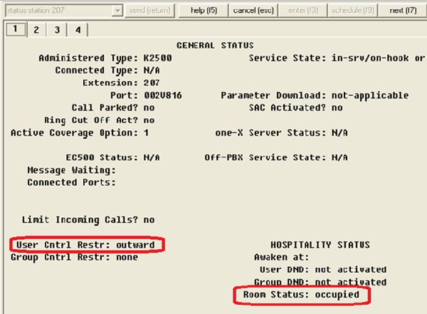
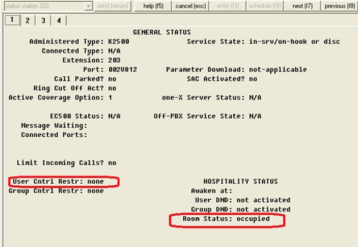

О как! Как раз этой проблемой занимаюсь, только у меня СОМ интерфейс. Но общий принцип такой же.

[http://neteq.ru/index.php/know-how/57-avayahosptitality](http://neteq.ru/index.php/know-how/57-avayahosptitality)

Настройка АТС Avaya для интеграции с сиcтемой управления гостиницей (PMS) по IP линку
Print Email
При внедрении гостиничной АТС возникает необходимость интеграции системы управления гостиницы (PMS) и телефонной станции. В результате внедрения такой интеграции появляется возможность реализовывать дополнительные услуги, например получать данные о статусе комнаты и управлять телефоном в номере. Кроме того возможна выдача сервисных кодов, например для учета использования минибара в номере.

АТС Avaya имеет встроенный функционал для интеграции с PMS. На старых АТС (Definity) был возможен стык через COM-порт, в настоящее время стык реализуется с помощью IP линка. Обратите внимание – поддержка функции Wakeup в IP линке между Avaya и Fidelio в настоящее время не предусмотрена.

 

Настройка АТС для интеграции с системой управления гостиницей

 

В станции для гостевых комнат делаем отдельные COR и COS

COS – с отметкой Client Room
Настройка COS

COR – все открыто

Настройка COR

Открываем контроль для PMS

Настройка System-Parameters Hospitality

Делаем сервис для PMS (предварительно необходимо прописать Node Name для PMS)

Настройка IP-сервиса для PMS

Проверка работы – sta pms-link

Проверка статуса IP-сервиса PMS

После активации линка PMS начинает управлять статусом телефона:

Номер вакантный
Номер занят, без возможности совершать вызовы
Номер занят, с возможностью совершать вызовы.

Статус номера - вакантный
 
 
  Статус номера – занят, без возможности совершать вызовы 
 
 
  Статус номера – занят, с  возможностью совершать вызовы 
 