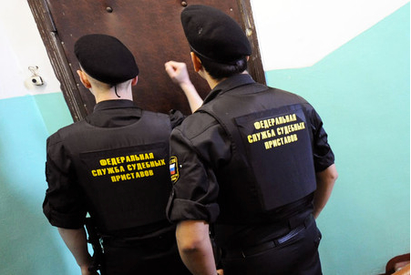

Ух ты! Процесс-то идёт. со скрипом не повсеместно, но процент рабочих станций и серверов на свободном ПО год от года растёт.

[http://gov.cnews.ru/news/top/sudebnye_pristavy_razrabotali_goslinux](Федеральная служба судебных приствов получила сертификат ФСТЭК на технологическую платформу и дистрибутив Linux, и может начинать их масштабное внедрение. Жестких сроков внедрения своих СПО-разработок служба устанавливать не будет, поскольку «много неудач с СПО в госорганах связаны именно с агрессивным навязыванием стандартизированных решений».)
http://gov.cnews.ru/news/top/sudebnye_pristavy_razrabotali_goslinux