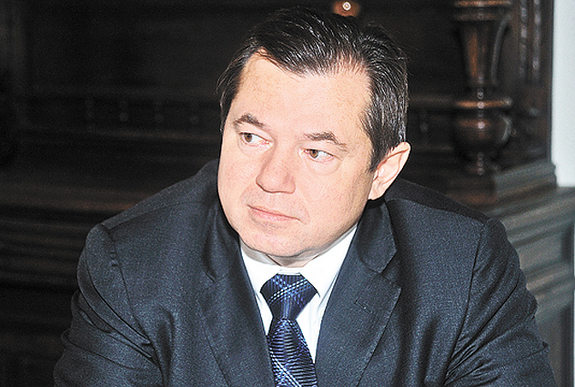
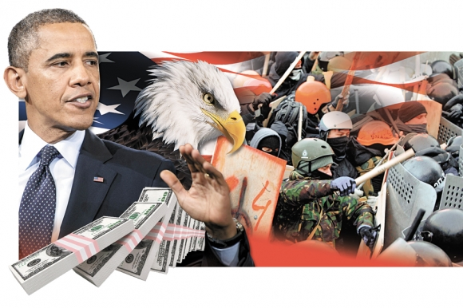

Очень грамотно сформулированное мнение о причинах выбора средств и целей САСШ в ситуации вокруг Украины. Приведены очень красочные и яркие исторические параллели. Очень советую в ОБЯЗАТЕЛЬНОМ порядке ознакомится всем интересующимся текущей международной политической и экономической обстановкой.

[Зачем Америке Майдан](http://argumenti.ru/toptheme/n441/344574?fb_action_ids=767921596586455&fb_action_types=og.recommends)
№ 21(413) от 10.06.2014 [«Аргументы Недели », Сергей ГЛАЗЬЕВ, академик Российской академии наук и Национальной академии наук Украины ]

Зачем Америке Майдан
Разворачивающаяся на Донбассе война несёт огромные угрозы России, Европе и всему миру, непонимание которых влечёт их автоматическое развёртывание в региональную, а затем и мировую войну. Представляемое в мировых СМИ изображение этой войны как борьбы украинской власти за целостность страны так же далеко от её смысла, как изображение гитлеровской пропагандой нападения на Польшу как защиты Германии от польской агрессии. Ненамного глубже даётся трактовка этой войны в российских СМИ – как сопротивление населения Донбасса нацистской хунте, противоправно захватившей власть в Киеве.

Между тем, без понимания причин и движущих сил эскалации вооружённого конфликта остановить его невозможно. Об этом говорит безрезультатность проводившихся до сих пор переговоров о прекращении насилия и разрешения украинского кризиса. Казалось бы, все стороны должны быть заинтересованы в прекращении боевых действий на Донбассе. Они наносят ущерб Украине, России, самому Донбассу и угрожают Европе. Однако ни разу ещё западная сторона не выполнила своих обязательств. Неизменным результатом всех переговоров является прямой обман со стороны США и их киевских ставленников, использующих переговоры для отвода глаз и дезориентации партнёров.

Переговоры как обман

В начале высокопоставленные американские и европейские чиновники, усыпив бдительность Януковича уговорами о неприменении силы, подтолкнули нацистов к его насильственному свержению и привели к власти своё марионеточное правительство. Затем они принялись уговаривать Путина не применять силу,натравливая одновременно подконтрольную им хунту на репрессии против русского населения Украины. Сразу же после достижения договорённости о разоружении незаконных формирований и начале общенационального диалога вице-президент США Байден прибывает в Киев, чтобы поддержать действия хунты, после чего та начинает карательную операцию украинской армии против донбасского сопротивления. Бесконечно заверяя российского президента в приверженности миру и призывая к прекращению насилия, руководство США и ЕС последовательно поддерживают усиление террора украинских военных против населения Донбасса.При этом стоило России пойти навстречу договорённостям о деэскалации конфликта и отвести войска от украинской границы, нацистская хунта стала резко наращивать свои вооружённые силы в зоне конфликта и приступила к применению авиации и бронетехники против населения Донбасса.

Факты говорят о том, что американцы использовали переговоры исключительно для обмана партнёров. Выдавая себя за миротворцев и защитников прав человека, в действительности они прокладывали дорогу к насильственному захвату власти нацистам, которых затем поддержали в легализации своих боевиков на воинской службе и подтолкнули на применение армии против русского населения. При этом подконтрольные американцам и их ставленникам СМИ во всём обвиняют Россию, старательно делая из неё образ врага для Украины и пугало для Европы. Остервенелая лживость и истерическая русофобия украинских и ведущих мировых каналов не оставляют сомнений в том, что мы имеем дело с военно-пропагандистской машиной, репрессирующей всех объективных журналистов и навязывающей населению состояние антироссийского психоза.

 
Из этого анализа следует, что США с самого начала украинского кризиса неуклонно следуют стратегии раздувания конфликта в украинско-российскую войну, оправдывая все преступления нацистской хунты, финансируя и вооружая её, прикрывая дипломатически и принуждая своих европейских союзников делать то же самое. Возникает вопрос, зачем они это делают?

Уж точно не ради Украины, которая обрекается этой войной на раскол, гуманитарную и экономическую катастрофу. И конечно же, не из абстрактных целей защиты демократических прав и свобод, которые ежедневно нагло попираются нацистской хунтой, совершающей массовые убийства своих граждан.

Как хорошо видно по риторике и действиям американских политиков и должностных лиц, эта война разворачивается США против России, в которой нацистская хунта выступает не более чем орудием в руках у американского руководства, а народ Украины используется в качестве «пушечного мяса» и одновременно жертвы российской «агрессии». Непосредственной целью этой войны является отрыв Украины от России, что в качестве важнейшей геополитической задачи Запада ставил ещё Бисмарк, а в современных условиях – Бжезинский. Его русофобская формула о том, что без Украины Россия не может быть великой державой, стала руководящим лейтмотивом всей американской политики на постсоветском пространстве. К этой цели США шли все два десятилетия после распада СССР, потратив на выращивание антироссийской политической элиты в Киеве, по сведениям помощника Госсекретаря США Нуланд, более 5 млрд. долларов.

По замыслу натовских стратегов отрыв Украины от России должен быть оформлен подчинением Украины Евросоюзу в форме Ассоциации, посредством которой Киев отдаёт суверенные права Украины в области регулирования внешнеэкономической деятельности, проведения внешней и оборонной политики Брюсселю. Отказ Януковича подписывать Соглашение об ассоциации был воспринят США как выход украинского руководства из подчинения и как угроза возобновления естественного процесса восстановления единого экономического пространства с Россией. Для предотвращения вступления Украины в Таможенный союз с Россией, Белоруссией и Казахстаном и возвращения Украины на путь европейской интеграции, собственно, и был организован государственный переворот, сразу после которого лидеры ЕС поспешили подписать с нелегитимной нацистской хунтой противоречащий украинской Конституции Договор об ассоциации в политической части. Сразу же после провозглашения Порошенко президентом он заявил о готовности подписать Соглашение об ассоциации в полном объёме, несмотря на его несовместимость как с Основным законом, так и с национальными интересами Украины.

Однако, как показывают сегодняшние действия США, одного только перехода Украины под юрисдикцию ЕС в рамках навязанного Киеву Соглашения об ассоциации им недостаточно. Они хотят столкнуть Украину с Россией в военном конфликте и втянуть в этот конфликт Евросоюз. Заставляя подчинённую им нацистскую хунту вести полномасштабную войну на Донбассе, США создают в центре Европы расширяющуюся воронку хаоса, которая нацелена на втягивание в братоубийственный конфликт вначале России, а затем и близлежащих европейских стран. Делается это не только для ослабления России, но и для ухудшения положения Евросоюза.

Войны – источник подъёма США

Исторический опыт свидетельствует о том, что войны в Европе были важнейшим источником экономического подъёма и политического могущества США.Последние стали сверхдержавой вследствие Первой и Второй мировых войн, которые повлекли гигантский отток капиталов и умов из воюющих между собой европейских стран в Америку. Третья мировая война, оставшаяся холодной, завершилась распадом мировой социалистической системы, что дало США приток более триллиона долларов, сотен тысяч специалистов, тонн плутония и других ценных материалов, множества уникальных технологий. Все эти войны были спровоцированы при активном участии американской «пятой колонны» в лице контролируемых, финансируемых и поддерживаемых американскими спецслужбами шпионов, олигархов, дипломатов, чиновников, бизнесменов, экспертов и общественных деятелей. И сегодня, сталкиваясь с экономическими трудностями, США пытаются развязать в Европе очередную войну для достижения следующих целей.

Во-первых, обвинение России в агрессии позволяет ввести финансовые санкции с целью замораживания (списания) американских обязательств перед российскими структурами в размере нескольких сотен миллиардов долларов для облегчения запредельного долгового бремени США.

Во-вторых, замораживание российских активов в долларах и евро повлечёт неспособность их владельцев обслуживать свои обязательства перед в основном европейскими банками, что создаст последним серьёзные трудности, чреватые банкротством некоторых из них. Дестабилизация европейской банковской системы будет стимулировать отток капитала в США для подержания долларовой пирамиды их долговых обязательств.

В-третьих, санкции против России нанесут ущерб странам ЕС на сумму около триллиона евро, что ухудшит и без того плохое состояние европейской экономики, ослабит её положение в конкурентной борьбе с США.

В-четвёртых, санкции против России облегчают вытеснение с европейского рынка российского газа с целью его замещения американским сланцевым. То же касается многомиллиардного восточноевропейского рынка тепловыделяющих элементов для атомных электростанций, который технологически ориентирован на поставки из России.

В-пятых, втягивание европейских стран в войну с Россией усилит их политическую зависимость от США, что облегчит последним решение задачи навязывания ЕС зоны свободной торговли на выгодных США условиях.

В-шестых, война в Европе даёт повод для наращивания военных расходов в интересах военно-промышленного комплекса США.

Сами США от развязываемой ими новой войны в Европе почти ничего не теряют. В отличие от европейских стран, с Россией они торгуют мало, и их рынки почти не зависят от российских поставок. Как и в других европейских войнах, они будут в чистом выигрыше.

Таким образом, натравливая нацистскую хунту на Россию, США ничем не рискуют и наверняка выигрывают. Американские советники навязывают своим киевским ставленникам использование самого жестокого по отношению к населению оружия: фугасно-осколочных снарядов, кассетных авиабомб, мин. Ведь чем больше будет жертв, тем выше ожидания российского военного вмешательства для защиты русского населения, тем выше риск новой европейской войны и тем больше американский выигрыш. Этот выигрыш измеряется не только деньгами. Главный приз, ради которого США провоцируют новую мировую войну, – это сохранение мирового доминирования в условиях глобальных структурных изменений, обусловленных сменой технологических укладов.

Исследования показывают, что в такие периоды глобальных технологических сдвигов передовым странам трудно сохранить лидерство, так как на волне роста нового технологического уклада вперёд вырываются развивающиеся страны, преуспевшие в подготовке предпосылок его становления. В отличие от передовых стран, сталкивающихся с кризисом перенакопления капитала в устаревших производствах, у них есть возможность избежать массового обесценивания капитала и сконцентрировать его на прорывных направлениях роста.

Для удержания лидерства передовым странам приходится прибегать к силовым приёмам во внешней и внешнеэкономической политике.В эти периоды резко возрастает военно-политическая напряжённость, риски международных конфликтов. Об этом свидетельствует трагический опыт двух предыдущих структурных кризисов мировой экономики.

Так, Великая депрессия 30-х годов, обусловленная достижением пределов роста доминировавшего в начале века технологического уклада «угля и стали», была преодолена милитаризацией экономики, которая вылилась в катастрофу Второй мировой войны. Последняя не только стимулировала структурную перестройку экономики с широким использованием двигателя внутреннего сгорания и органической химии, но повлекла кардинальное изменение всего мироустройства: разрушение тогдашнего ядра мировой экономической системы (европейских колониальных империй) и формирование двух противоборствующих глобальных политико-экономических систем. Лидерство американского капитализма в выходе на новую длинную волну экономического роста было обеспечено чрезвычайным ростом оборонных заказов на освоение новых технологий и притоком мировых капиталов в США при разрушении производственного потенциала и обесценении капитала основных конкурентов.

Депрессия середины 70-х – начала 80-х годов повлекла гонку вооружений в ракетно-космической сфере с широким использованием информационно-коммуникационных технологий, составивших ядро нового технологического уклада. Последовавший вслед за ней коллапс мировой системы социализма, не сумевшей своевременно перевести экономику на новый технологический уклад, позволил ведущим капиталистическим странам воспользоваться ресурсами бывших социалистических стран для «мягкой пересадки» на новую длинную волну экономического роста. Вывоз капитала и утечка умов из бывших социалистических стран, колонизация их экономик облегчили структурную перестройку экономики стран ядра мировой капиталистической системы, до этого стимулировавших становление нового технологического уклада посредством развёртывания гонки вооружений в космосе. На этой же волне роста нового технологического уклада поднялись новые индустриальные страны, сумевшие заблаговременно создать его ключевые производства и заложить предпосылки их быстрого роста в глобальном масштабе. Политическим результатом стала либеральная глобализация с доминированием США в качестве эмитента основной резервной валюты.

Разделяй и властвуй

Исчерпание потенциала роста доминирующего технологического уклада стало причиной глобального кризиса и депрессии, охвативших ведущие страны мира в последние годы. Выход из этого произойдёт на волне роста нового технологического уклада, в основе которого лежит комплекс нано-и биотехнологий.И, хотя основная сфера применения этих технологий не связана с производством военной техники, гонка вооружений и увеличение военных расходов привычным образом становится ведущим способом государственного стимулирования становления нового технологического уклада.

Дело в том, что либеральная идеология, доминирующая в правящих кругах США и их союзников по НАТО, не оставляет для государства иных поводов для расширения вмешательства в экономику, кроме нужд обороны. Поэтому, сталкиваясь с необходимостью использования государственного спроса для стимулирования роста нового технологического уклада, ведущие деловые круги прибегают к эскалации военно-политической напряжённости как основному способу увеличения государственных закупок передовой техники. Именно в этом ракурсе следует рассматривать причины раскрутки Вашингтоном маховика войны на Украине, которая является не целью, а инструментом для реализации глобальной задачи сохранения доминирующего влияния США в мире.

Наряду со структурным кризисом мировой экономики, обусловленным сменой доминирующих технологических укладов, в настоящее время происходит переход к новому вековому циклу накопления капитала, что усугубляет риски развязывания мировой войны. Предыдущий переход от колониальных империй европейских стран к глобальным корпорациям в качестве ведущей формы организации мировой экономики происходил посредством развязывания трёх мировых войн, исход которых сопровождался кардинальными изменениями мирового политического устройства. В результате Первой мировой войны рухнул монархический строй, сдерживавший экспансию национального капитала. В результате Второй – развалились колониальные империи, ограничивавшие международное движение капитала. С крахом СССР вследствие третьей – холодной – мировой войны свободное движение капитала охватило весь мир, а транснациональные корпорации получили в распоряжение всю мировую экономику.

Но на этом история не заканчивается. Развитие человечества требует новых форм организации глобальной экономики, которые позволили бы обеспечить устойчивое развитие и отражение планетарных угроз, включая экологические и космические. В условиях либеральной глобализации, выстроенной под интересы транснациональных, в основном англо-американских, корпораций, эти вызовы существованию человечества остаются без ответа. Объективно возникающая необходимость обуздания мировой олигархии и упорядочивания движения мирового капитала достигается в восточноазиатской модели организации современной экономики. С подъёмом Китая, Индии и Вьетнама вслед за Японией и Кореей наиболее вдумчивые исследователи заговорили о переходе от Англо-американского к Азиатскому вековому циклу накопления капитала.

В свете охарактеризованных выше глобальных изменений понятно, что борьба за мировое лидерство разворачивается между США и Китаем, в которой США для сохранения своего доминирования разыгрывают привычный им сценарий развязывания мировой войны в Европе, пытаясь в очередной раз за счёт Старого Света упрочить своё положение в мире. Для этого они используют старый английский геополитический принцип «разделяй и властвуй», воскрешая подсознательную русофобию политических элит европейских стран и делая ставку на традиционный для них «дранг нахт остен». При этом, следуя заветам Бисмарка и советам Бжезинского, в качестве главной линии раскола они используют Украину, рассчитывая, с одной стороны, на ослабление и агрессивную реакцию России, а с другой – на консолидацию европейских государств в их традиционном стремлении к колонизации украинских земель.

Расчёт американских геополитиков кажется точным, а действия – безошибочными. За полгода они провели блицкриг, фактически оккупировав Украину и подчинив себе ЕС в антироссийской истерии. При этом уже окупили за счёт присвоения части украинских активов полтора миллиарда долларов, потраченных на организацию госпереворота и приведение к власти своего марионеточного правительства с относительной легитимизацией своего агента в качестве президента Украины. Россия сумела спасти от оккупации американо-нацистским режимом только Крым, а истекающий кровью Донбасс становится хронической зоной вооружённого конфликта между Украиной и Россией. Последнюю, как кажется американским кукловодам, они заманили в политический капкан. Применение Российской армии для освобождения Донбасса гарантирует втягивание в войну против России ЕС и НАТО. Неприменение силы для принуждения нацистской хунты к миру повлечёт создание разрастающейся воронки хаоса в центре Европы, которая уже интернационализируется, становясь очагом дестабилизации России.

Развёртывание региональной, а возможно, и мировой войны на выгодных США условиях кажется неизбежным. Россия представляется им обречённой на тяжёлое поражение вследствие уже состоявшейся потери Украины, во-первых, и консолидации всех развитых стран мира, включая наряду с союзниками по НАТО Японию и Корею, во-вторых. По замыслу американских геополитиков поражение России должно повлечь возвращение её под американский контроль, как это было при Ельцине, а ослабление Европы – её экономическое подчинение посредством формирования трансатлантической зоны свободной торговли на американских условиях. Тем самым Вашингтон надеется укрепить своё положение и сохранить мировое господство в конкуренции с поднимающимся Китаем.

В этой «железной» и циничной логике есть, однако, просчёт. Действуя на основе архетипов европейской геополитики двухсотлетней давности, американцы воскресили трупы еврофашизма и соорудили в Киеве политического Франкенштейна, который начал пожирать своих родителей. Первой запланированной жертвой стал Янукович и его приближённые, растившие украинских нацистов как спарринг-партнёров. Следующей жертвой стали проигравшие выборы в Европейский парламент европейские политики, поддержавшие государственный переворот. Киевский Франкенштейн вплотную подбирается к своей маме – Эштон и, возможно, скоро доберётся и до своего папы – Обамы. Ему нужно только помочь найти дорогу.

Чтобы остановить войну, нужно прекратить действие движущих ею сил. На данном этапе война разворачивается преимущественно в экономической, информационной и политической плоскостях. При всей мощи США их экономическое превосходство основано на финансовой пирамиде долговых обязательств, которая давно вышла за пределы устойчивости. Для её обрушения основным кредиторам США достаточно сбросить на рынок накопленные американские доллары и казначейские обязательства. Разумеется, крах финансовой системы США повлечёт серьёзные потери всех держателей американских валюты и ценных бумаг. Но, во-первых, эти потери для России, Европы и Китая будут меньше, чем ущерб от развязываемой американскими геополитиками очередной мировой войны. Во-вторых, чем раньше выйти из финансовой пирамиды американских обязательств, тем меньше будут потери. В-третьих, крах долларовой финансовой пирамиды даст наконец возможность осуществить реформу мировой финансовой системы на началах справедливости и взаимной выгоды.

Доминирование США в информационной сфере является ключевым фактором зомбирования европейцев, подчиняющим таким образом своему влиянию политическое руководство европейских стран. Но, как говорил Александр Невский, не в силе Бог, но в правде. Потоку лжи и фальсификации, транслируемому контролируемыми США мировыми СМИ, необходимо противопоставить объективный информационный поток через социальные сети, региональное и национальное телевидение. Это, разумеется, потребует усилий. Но при творческом подходе правда пробьёт себе дорогу, поскольку угроза новой мировой войны пугает каждого человека и, в конечном счёте, стимулирует поиск её причин. Общественное подсознание европейских народов, тем более народа Украины, быстро вспомнит ужасы прошлой войны при правильном формировании ассоциативного ряда современных и настоящих фашистов и их пособников. Выращенный американскими геополитиками Франкенштейн выглядит ничем не лучше гитлеровских штурмовиков, объективная подача информации об украинских нацистах быстро вызовет чувство отвращения и испуга у европейского обывателя.

Наконец, доминирование США в мировой политике основывается больше на привычке их союзников подчиняться «Вашингтонскому обкому», чем на реальной зависимости европейских и японских политиков американской резидентуре. Как только начнёт разваливаться долларовая финансовая пирамида, американцам нечем будет платить за содержание своих военных баз и глобальных СМИ. Германия и Япония смогут освободиться от гнетущего ощущения оккупированных территорий.

Разумеется, не следует изображать США в качестве «колосса на глиняных ногах». В руках американских геополитиков оружие массового поражения, способное уничтожить всё человечество. И когда дамы из Белого дома хвалят украинских нацистов за «сдержанное» применение силы, мир охватывает ужас от безответственной глупости и бравады хозяев Белого дома, способных ради личного имиджа уничтожить полчеловечества. Эти намерения США уже демонстрировали при президентах Эйзенхауэре, Трумэне, которые хотели забросать атомными бомбами Корею; при Кеннеди, который едва не начал атомную войну с СССР; при Рейгане, который угрожал звёздными войнами.

Нынешняя ситуация, однако, отличается от эпохи холодной войны тем, что американская администрация не рассматривает Россию в качестве равного соперника, пытаясь вернуть нас в пораженческое состояние при Ельцине. Американские советники как нынешнего, так и прошлого украинского руководства неустанно убеждали последнее в своём тотальном превосходстве над Россией, которую представляли в качестве американского доминиона. Опьянённые развалом СССР, американские геополитики считают Россию своей взбунтовавшейся колонией, которую надо усмирить навсегда как неотъемлемую часть своей империи. Они исходят из нежизнеспособности России в условиях глобальной изоляции, явно переоценивая степень своего влияния. Эта переоценка своих возможностей подводит американских геополитиков, с одной стороны, порождает у них ощущение безнаказанности и вседозволенности, создавая риск глобальной катастрофы. Но, с другой стороны, она является источником их слабости при столкновении с реальным сопротивлением, к которому они морально-политически не готовы.

Так решительные действия руководства России по отражению американо-грузинской агрессии в Южной Осетии, а также спасению населения Крыма от геноцида со стороны выращенных США украинских нацистов не оставили им шансов на победу. Столкнувшись с решительным сопротивлением Асада, США и их европейские союзники так и не смогли оккупировать Сирию. Они побеждали только там, где жертва не могла оказать реального сопротивления в силу либо деморализации и предательства властвующей элиты, как в Ираке или Югославии, либо тотального превосходства сил агрессора, как это было в Ливии.

Инстинкт национального самосохранения, присущий ВВП, ставит жёсткий предел любому иностранному вмешательству в проведение российской политики. Попытки запугать его санкциями, международной изоляцией или поддержкой оппозиции успеха иметь не будут. Так же как и сами санкции или изоляция со стороны Запада в силу глобального значения России и многовекторности её внешней политики. К сожалению, лауреат Нобелевской премии мира Обама этого не понимает. Он идёт на поводу у реакционных сил, рассчитывающих на лёгкую неоколонизацию России и наивно убеждённых в вечном господстве Америки.

Исходя из того, что вооружённый конфликт на Украине является прологом очередной мировой войны, развязываемой США против России в целях удержания мирового господства, для её купирования и одержания Победы, необходимо выстроить правильную систему координат и точно определить действия всех участников. Поле боевых действий имеет следующую конфигурацию:

– США являются страной-агрессором, провоцирующим мировую войну с целью удержания мирового господства;

– провокация мировой войны ведётся против России, которую США пытаются представить в качестве агрессора в целях консолидации западного мира для отстаивания американских интересов;

– американские геополитики сделали ставку на выращивание русофобствующего украинского нацизма в продолжение германской и английской традиций ослабления России;

– Украина фактически оккупирована США посредством организованного ими госпереворота и установления подконтрольной им нацистской диктатуры;

– европейские страны принуждаются к участию в войне против России вопреки их национальным интересам.

Исходя из этого мы должны оценивать Сопротивление Донбасса как движение в защиту не только местного населения от нацистской хунты, но и в защиту России от американской агрессии, а также всего мира – от четвёртой мировой войны. Бойцы народного ополчения Донбасса – это защитники Русского мира, не по своей воле оказавшиеся на передовой новой мировой войны. Город с символичным названием Славянск уже стал символом этой героической защиты. Как Брестская крепость, этот маленький город противостоит многократно превосходящим силам еврофашистов ценой жизни своих жителей. Они погибают не только за Донбасс, они погибают за всех людей русского мира и всего человечества, спасая нас от новой мировой войны. При этом они щадят жизни украинских военнослужащих, отпускают на волю пленных, направляемых на заклание нацистской хунтой.

При всём героизме бойцов народной армии Донбасса сами остановить мировую войну они не могут. Военное вмешательство России могло бы переломить ситуацию и остановить агрессию нацистской хунты. Но его результатом одновременно станет втягивание в конфликт НАТО, что повлечёт его интернационализацию и станет ещё одним шагом к развязыванию мировой войны. Чтобы её остановить, нужно создать широкую международную коалицию стран, способную согласованными действиями прекратить американскую агрессию.Эти действия должны быть направлены на подрыв американской военно-политической мощи, основанной на эмиссии доллара как мировой валюты. Прежде всего они должны включать отказ от использования доллара во взаимной торговле и номинированных в долларах ценных бумаг для размещения валютных резервов. Долларовые инструменты должны оцениваться как крайне рискованные, а их использование – требовать максимального резервирования.

Наряду с мерами по подрыву возможностей США финансировать рост военных расходов необходимы политические усилия по формированию широкой антивоенной коалиции с целью осуждения американской агрессии и разоблачения её организаторов в Вашингтоне и Брюсселе. Особое значение имеет политическая активизация европейского бизнеса, которому развязывание новой войны в Европе ничего хорошего не сулит.

И конечно, важнейшей задачей является освобождение Украины от установленного США нацистского режима.Формирование Новороссии на освобождённой от американо-нацистской оккупации территории является лишь частью этой работы. Она может считаться завершённой только после освобождения Киева силами самого народа Украины, который необходимо пробудить от нацистского кошмара и поддержать в борьбе за возвращение в родное лоно Русского мира. Для этого нужна широкая работа по разъяснению истинных целей проамериканской нацистской хунты, которая использует оболваненных фашистской пропагандой граждан Украины в качестве жертвы богу мировой войны.