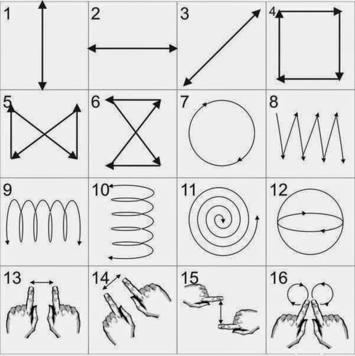

Такие зарядки позволяют не только тренировать глаза, но и хорошо разделяют этапы работы.

Запись создана пользователем Naked Science
Сохраняем зрение—простая и полезная зарядка для глаз
(«Science-Health»)

В среднем человек моргает примерно 20 раз в минуту. Но, когда мы уставимся в монитор или телевизор, процесс моргания сильно замедляется и в итоге глаз начинает "высыхать", что приводит к ухудшению зрения. Именно поэтому, существует простая и быстрая зарядка для глаз, которая поможет держать влажность роговицы глаза всегда на должном уровне.

Итак, начнем:
1) 10 секунд быстро поморгайте, а потом столько же смотрите просто перед собой (повторить 3 раза)
2) Закрываем глаза и начинаем вращать глазным яблоком влево-вправо-вверх-вниз (4 повтора)
3) Закрываем глаза и начинаем смотреть вверх и вниз (4 раза)
4)Крепко-крепко зажмурьте свои глаза,а потом резко и широко откройте (повторить 5 раз)
Данная зарядка займет у Вас максимум 2 минуты, но поможет сохранить зрение на долгие годы. Так же, как альтернативу, можно использовать любые 4 упражнения из этого списка и повторить их по 4 раза каждое.