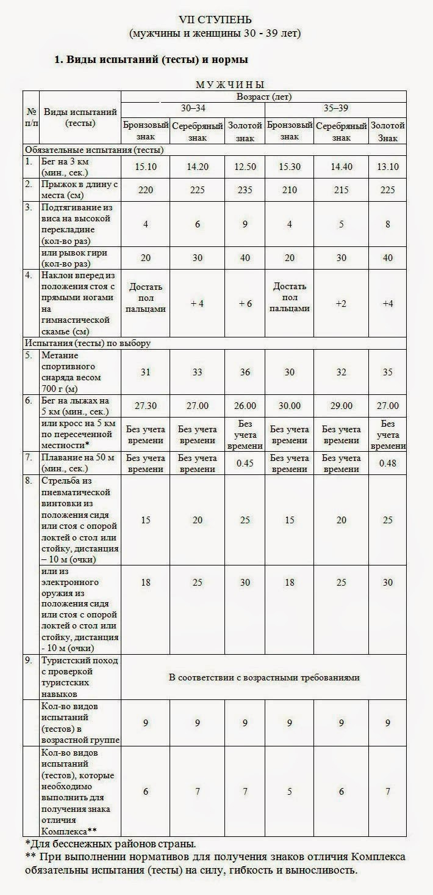
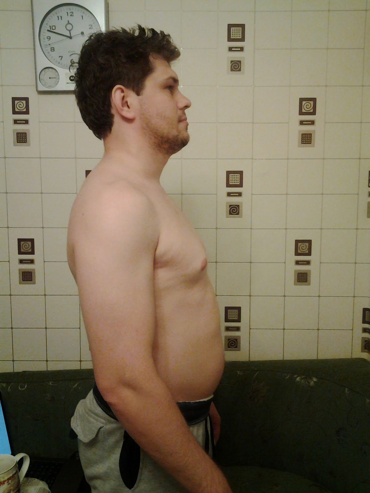
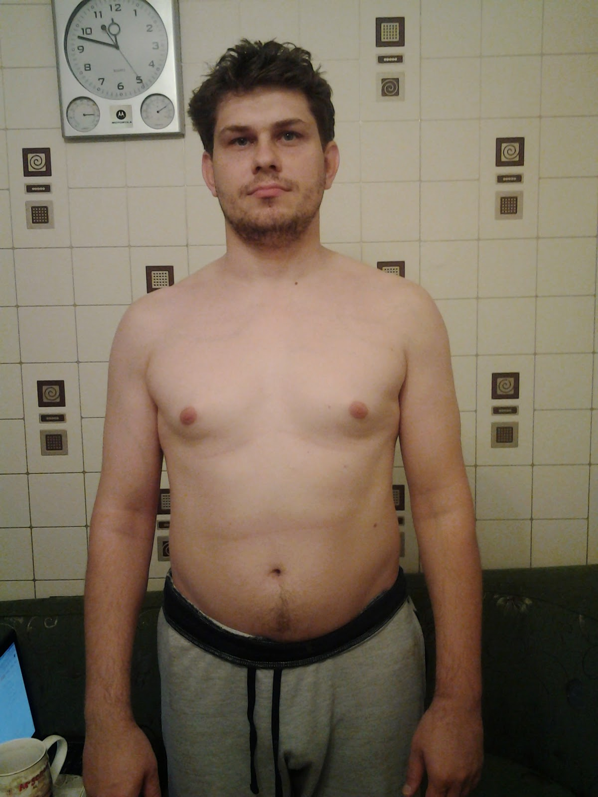

У меня сейчас заканчивается отпуск и больше половины его я проболел. Такая ситуация со здоровьем мне не то что не нравится, она повергает меня в ужас. Вместе с внешним видом (пузом, синяками под глазами, одышкой и всем прочим). Поэтому было решено ввязаться в бесконечную и безнадежную борьбу с ленью и внешними факторами за здоровье.

Недолго думая, за первую цель были приняты нормы ГТО, при том что в Краснодарский край, к моему огромному удивлению, не входит в перечень регионов где уже в этом году можно было бы их сдавать. Но ничего, как раз будет время подготовиться.

Нормы для моей возрастной группы следующие:

Источник - первый в выдаче Яндекса сайт по запросу "Нормы ГТО" - [http://www.gto-normy.ru/.](http://www.gto-normy.ru/)

Как говорили латиняне - Motus vita est! (Движение - жизнь!).

Мои текущие параметры:

Рост 180 см.

Вес 85,8 кг.

Подтягивания - 2 раза
Отжимания - 23 раза

Бег - 500 метров и запыхался

А вот что я представляю из себя на сегодняшний день (жалкое зрелище слабонервным лучше не смотреть):

Посмотрим что из меня выйдет через некоторое время.