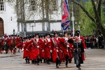

Завтра и я там буду.

> [В Краснодаре состоится юбилейный парад Кубанского казачьего войска](http://krasnodar.bezformata.com/listnews/parad-kubanskogo-kazachego-vojska/46178949/)
> 
> Парад, который пройдет в краевом центре в субботу 23 апреля, посвящен 25-летию со дня принятия Закона РФ «О реабилитации репрессированных народов и казачества». В мероприятии примут участие более 10 тысяч казаков, кадет и учащихся казачьих классов.
> 
> Как сообщили в пресс-службе Кубанского казачьего войска, торжества в кубанской столице в 10.30 откроет молебен у войскового Собора Святого Благоверного князя Александра Невского.
> 
> Затем казачьи парадные расчеты пройдут по улице Красной и построятся на Театральной площади. В 12.00 после выступления атамана Кубанского войска Николая Долуды и почетных гостей начнется торжественное прохождение казачьих парадных расчетов и военнослужащих.
> 
> Также в параде примут участие взвод барабанщиков, пешая и конная группы Почетного караула, представители Кубанского казачьего хора и казачьих кадетских корпусов.
> 
> Как сообщили в мэрии Краснодара, во время подготовки и проведения казачьего парада в центре города ограничат движение.
> 
> Пресс-служба администрации Краснодарского края 