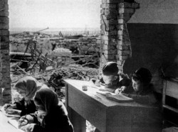

[Столетие](http://www.stoletie.ru/territoriya_istorii/otvet_stalingrada_517.htm)

Возрождение города-героя начиналось… со школ
Людмила Овчинникова

11.03.2016

В газетах появляются пугающие цифры: в России 2 миллиона детей школьного возраста не ходят в школу. Они остаются неграмотными. Тысячи школ закрыты в сельской местности. В городах растет чисто беспризорников. Когда я читаю эти сообщения, то невольно вспоминаю, как мы учились в разрушенном Сталинграде. Возрождение города-героя началось именно со школ.

Деревянные улицы вокруг нашего дома сгорели, и, казалось, изрытый воронками Мамаев курган подвинулся к нам ещё ближе. Часами я бродила в поисках ящиков из-под снарядов. Из них мы сложили топчаны-кровати, соорудили стол и табуретки. Этими ящиками топили печурку.

Мы жили на огромном пепелище. От домов вокруг остались только обугленные печи. И чувство безысходной тоски, помню, не покидало меня: «Как мы будем жить?». Перед уходом из города бойцы полевой кухни оставили нам брикеты каши и полмешка муки. Но эти запасы таяли. Простуженные мама и 4-летняя сестренка лежали в углу, прижавшись друг к другу.

Я топила печь и готовила еду, сама себе напоминая пещерного человека: часами чиркая кремниевыми камешками, держа наготове паклю, старалась добыть огонь. Спичек не было. Собирала в ведерко снег и растапливала на печке.

Соседский мальчик сказал мне: под Мамаевым курганом в разрушенном цехе завода «Лазурь» выдают продукты. С мешком за плечами, в котором гремел немецкий котелок, я отправилась за продуктами. Нам не выдавали их с первых дней обороны Сталинграда, даже блокадных 100 граммов хлеба. Нас кормили бойцы.

Под Мамаевым курганом в руинах кирпичного здания я увидела женщину в потертом овчинном тулупе. Здесь выдавали продукты без денег и без продовольственных карточек. У нас их и не было. «У вас какая семья?» – только и спросила меня она. «Три человека», – честно ответила я. Могла бы сказать и десять – среди пепелищ это не проверишь. Но я была пионеркой. И меня учили – врать позорно. Я получила хлеб, муку, в котелок мне налили сгущенного молока. Выдали американскую тушенку.

Закинув мешок за плечи, я прошла несколько шагов, и вдруг на обугленном столбике увидела приклеенный листок, на котором было написано: «Дети с 1-го по 4-й класс приглашаются в школу». Был указан адрес: подвал завода «Лазурь». Я быстро нашла это место. Из-за деревянной двери подвала вырывались клубы пара. Пахло гороховым супом. «Может быть, здесь будут кормить?» – подумалось.

Вернувшись домой, сказала маме: «Пойду в школу!». Она удивилась: «Какая школа? Все школы сожжены и разбиты».

Перед началом осады города я собиралась пойти в 4-й класс. Радости не было предела.

Однако дойти до школы в подвале было не так просто: надо преодолеть глубокий овраг. Но поскольку в этом овраге мы играли и зимой и летом, я спокойно отправилась в дорогу. В овраг я привычно скатилась на полах пальто, а вот вылезти на противоположный крутой, заснеженный склон оказалось нелегко. Я хваталась за обрубленные ветки кустов, за пучки полыни, гребла густой снег руками. Когда вылезла на склон и огляделась – справа и слева от меня наверх карабкались дети. «Тоже идут в школу?» – подумала я. Так оно и вышло. Как потом узнала, некоторые жили еще дальше от школы, чем я. И на своем пути преодолевали даже два оврага.

Спустившись в подвал, над которым было написано: «Школа», я увидела сколоченные из досок длинные столы и скамейки. Как оказалось, каждый стол был закреплен за одним классом. На стене вместо доски была приколочена зеленая дверь. Между столами ходила учительница – Полина Тихоновна Бурова. Она успевала дать задание одному классу и вызвать к доске кого-то из другого. Разноголосица в подвале стала для нас привычной.

Вместо тетрадей нам выдали толстые конторские книги и так называемые «химические карандаши». Если смочить кончик стержня, то буквы выходили жирные, четкие. А если постругать ножом стержень, и залить водой – получались чернила.

Полина Тихоновна, старалась отвлечь нас от тяжелых мыслей, подбирала нам для диктантов далекие от темы войны тексты. Ее мягкий голос, помню, ассоциировался у меня с шумом ветра в лесу, терпким запахом степных трав, блеском песка на волжском островке.

В наш подвал постоянно доносились звуки взрывов. Это саперы очищали от мин железную дорогу, которая опоясывала Мамаев курган. «Скоро по этой дороге пойдут поезда, приедут строители восстанавливать наш город», – говорила учительница.

Никто из ребят, услышав взрывы, не отвлекался от занятий. Все дни войны в Сталинграде мы слышали взрывы и пострашнее, и поближе.

Даже сейчас, вспоминая нашу подвальную школу, не перестаю удивляться. На заводах еще не дымилась ни одна труба, не был пущен ни один станок, а мы, дети заводских рабочих, уже сидели в школе, выводили буквы и решали арифметические задачи.

Потом от Ирины, дочери Полины Тихоновны, мы узнали, как они добирались в город. В дни боев они эвакуировались в заволжское село. Когда услышали о победе под Сталинградом, то решили вернуться в город… Они шли в пургу, боясь заблудиться. Единственным ориентиром была Волга. В попутных хуторах их пускали к себе незнакомые люди. Давали еду и теплый угол. Полина Тихоновна и ее дочь прошли пятьдесят километров.

На правом берегу сквозь снежное марево они увидели руины домов, разбитые корпуса заводов. Это был Сталинград. По замерзшей Волге добрались в свой поселок. На месте родного дома остались только обугленные камни. До вечера бродили по тропкам. Вдруг из землянки вышла женщина. Она увидела и узнала Полину Тихоновну – учительницу своей дочери. Женщина позвала их в землянку. В углу, прижавшись друг к другу, сидели трое худых, затравленных войной детей. Женщина угостила гостей кипятком: такого понятия, как чай, не было в той жизни.

На другой день Полину Тихоновну потянуло к родной школе. Построенная перед войной белая, кирпичная, она была разрушена: здесь шли бои.

Мать и дочь пошли к центру поселка – к площади перед металлургическим заводом «Красный Октябрь», который был гордостью города. Здесь выпускали сталь для танков, самолетов, артиллерийских орудий. Теперь мощные мартеновские трубы были обрушены, разбиты бомбами корпуса цехов. На площади они увидели человека в стеганой фуфайке и тут же узнали его. Это был секретарь Краснооктябрьского райкома партии Кашинцев. Он поравнялся с Полиной Тихоновной и, улыбнувшись, сказал ей: «Вот и хорошо, что вы вернулись. Я ищу учителей. Надо открывать школу! Если вы согласитесь, есть хороший подвал на заводе «Лазурь». В землянках вместе с матерями остались дети. Надо постараться помочь им».

Полина Тихоновна отправилась на завод «Лазурь». Нашла подвал – единственный, сохранившийся здесь. У входа стояла солдатская кухня. Здесь можно будет варить детям кашу.

Бойцы МПВО вынесли из подвала разбитые пулеметы, гильзы. Полина Тихоновна написала объявление, которое поместила рядом с продуктовым ларьком. К подвалу потянулись дети. Так начиналась наша первая школа в разрушенном Сталинграде.

Потом уже мы узнали, что Полина Тихоновна вместе с дочерью жила в солдатском блиндаже на волжском откосе. Весь берег был изрыт такими солдатскими землянками. Их постепенно стали занимать вернувшиеся в город сталинградцы. Ирина рассказала нам, как они, помогая друг другу, с трудом выползали наверх по волжскому откосу - так Полина Тихоновна добиралась на урок. Ночью в блиндаже они стелили одно пальто на пол, а другим укрывались. Потом им подарили солдатские одеяла. Но к нам Полина Тихоновна всегда приходила подтянутая, со строгой прической. Меня больше всего поражал ее белый воротник на темном шерстяном платье.

Сталинградцы в ту пору жили в самых тяжелых условиях. Вот обычные картинки тех дней: пролом стены занавешен солдатскими одеялами – там люди. Свет коптилки пробивается из подвала. Под жилье занимали разбитые автобусы. Сохранились кинокадры: девушки-строители с полотенцами на плечах выходят из фюзеляжа сбитого немецкого самолета, стучат сапогами по немецкой свастике на крыле. Были и такие общежития в разрушенном городе… Жители варили еду на кострах. В каждом жилище стояли фронтовые лампы-«катюши». Патрон снаряда сдавливали с двух сторон. Внутрь щели просовывали полоску ткани, на дно наливали какую-нибудь жидкость, которая могла гореть. В этом чадящем круге света готовили еду, зашивали одежду, а дети готовились к урокам.

Полина Тихоновна сказала нам: «Дети, если найдете где-нибудь книги, приносите в школу. Пусть будут они даже – обгорелые, посеченные осколками». В нише стены подвала прибили полку, на которой появилась стопка книг. Зашедший к нам известный фотокорреспондент Георгий Зельма запечатлел эту картинку. Над нишей крупными буквами было выведено: «Библиотека».

…Вспоминая те дни, я больше всего удивляюсь тому, каким образом в детях теплилась тяга к учебе. Ничто – ни материнское наставление, ни строгие слова учителя не могли бы заставить нас перебираться через глубокие овраги, ползти по их склонам, идти по тропкам среди минных полей, чтобы занять свое место в школе-подвале за длинным столом.

Пережившие бомбежки и обстрелы, постоянно мечтавшие поесть досыта, одетые в залатанные обноски, мы хотели учиться.

Старшие дети – это был 4-й класс, помнили уроки еще в довоенной школе. А вот первоклассники, слюной смачивая кончики карандашей, выводили свои только первые буквы и цифры. Как и когда они-то успели получить эту благородную прививку – надо учиться! Непостижимо… Время, видно, было такое.

Когда в поселке появилось радио, репродуктор поместили на столбе над заводской площадью. И рано утром над разрушенным поселком раздавалось: «Вставай, страна огромная!». Может быть, это покажется странным, но детям военной поры казалось, что и к ним обращены слова этой великой песни.

Школы открывались и в других районах разрушенного Сталинграда. Спустя годы, я записала рассказ Антонины Федоровны Улановой, которая работала заведующей отделом народного образования Тракторозаводского района. Она вспоминала: «В феврале 1943 года в школу, где я работала после эвакуации, пришла телеграмма: «Выезжайте в Сталинград». Я отправилась в дорогу.

На окраине города в чудом сохранившемся деревянном доме нашла работников облоно. Получила такое задание: добраться в Тракторозаводский район и на месте определить – в каком здании можно собрать детей, чтобы начать уроки. В 30-е годы в нашем районе было построено четырнадцать прекрасных школ. Теперь я ходила среди руин – ни одной школы не осталось. По дороге встретила учительницу Валентину Григорьевну Скобцеву. Мы вместе стали искать помещение, хотя бы с крепкими стенами. Зашли в здание бывшей школы, которая была построена напротив тракторного завода. По ступеням разбитой лестницы поднялись на второй этаж. Ходили по коридору. Вокруг были куски штукатурки после бомбежки. Однако среди этого нагромождения камней и металла, нам удалось найти два помещения, где остались неразрушенные стены и потолки. Именно сюда, нам казалось, мы имеем право привести детей.

Учебный год начинали в марте. Повесили объявление об открытии школы на разбитых колоннах проходных тракторного завода. Я пришла на планерку, которую проводила дирекция завода. Выступила перед начальниками цехов: «Помогите школе»…

И каждый цех взялся сделать что-нибудь для детей. Помню, как через площадь рабочие несли металлические жбаны для питьевой воды. На одном из них было написано: «Детям от кузнецов».

Из прессового цеха в школу принесли отшлифованные до блеска металлические листы. Их поставили вместо классных досок. Они оказались очень удобными для письма. Бойцы МПВО побелили в классах стены и потолки. Вот только оконных стекол не нашли в районе. Открывали школу с разбитыми окнами».

Школьные классы в Тракторозаводском районе открыли в середине марта 1943 года. «У входа мы ждали своих учеников, – говорила А.Ф. Уланова. – Мне запомнился первоклассник Гена Хорьков. Он шел с большой холщовой сумкой. Мать, видимо, надела на мальчика самое теплое, что нашла – стеганную на вате фуфайку, которая доходила ему до пят. Фуфайку перевязали веревкой, чтобы она не упала с плеч. Но надо было видеть – какой радостью светились глаза мальчика. Он шел учиться».

Первый урок – был единый для всех, пришедших в школу. Учительница В.Г. Скобцева назвала его уроком надежды. Она говорила детям о том, что город возродится. Будут построены новые кварталы, Дворцы культуры, стадионы.

Окна класса были разбиты. Дети сидели в зимней одежде. В 1943 году кинооператор запечатлел эту картину.

Впоследствии эти кадры вошли в киноэпопею «Неизвестная война»: дети, закутанные в платки, озябшими руками выводят буквы в тетрадках. Ветер, врываясь в разбитые окна, теребит страницы.

Поражает выражение лиц детей и то, с каким сосредоточенным вниманием они слушают учителя.

Впоследствии, через годы мне удалось найти учащихся этой первой школы Тракторозаводского района. Л.П. Смирнова, кандидат сельскохозяйственных наук, рассказывала мне: «Мы знали, в каких трудных условиях живут наши учителя. Кто в палатке, кто в землянке. Одна из педагогов жила под лестничной клеткой школы, огородив себе угол досками. Но когда учителя приходили в класс, мы видели перед собой людей высокой культуры. Что значило тогда для нас учиться? Это все равно, что дышать. Потом я сама стала педагогом и осознала, что наши учителя умели поднять урок до духовного общения с детьми. Несмотря на все тяготы, они сумели внушить нам жажду познания. Дети не только изучали школьные предметы. Глядя на своих педагогов, мы учились трудолюбию, стойкости, оптимизму». Л.П. Смирнова рассказала также о том, как обучаясь среди руин, они увлеклись театром. По программе проходили «Горе от ума» А.С. Грибоедова. Дети под руководством учителей поставили это произведение в школе. Софья вышла на сцену в длинной юбке с кружевами, которая передала ей бабушка. Эту юбку, как и другие вещи, зарывали в землю, чтобы сберечь их во время пожара. Девочка, чувствуя себя в нарядной юбке до пят, произносила монологи Софьи. «Мы тянулись к творчеству, – говорила Л.П. Смирнова. – Писали стихи и поэмы».

В Сталинград, по призыву ЦК комсомола, приехали тысячи молодых добровольцев. На месте они учились строительному делу. А.Ф. Уланова рассказывала: «Наш завод был оборонным – выпускал танки. Надо было восстанавливать цеха. Но часть молодых строителей направили на ремонт школ. Около фундамента нашей школы появились груды кирпичей, доски и ручная бетономешалка. Так выглядели приметы возрождающейся жизни. Школы были в числе первых объектов, которые восстанавливали в Сталинграде».

1-го сентября 1943 года на площади перед тракторным заводом состоялся митинг. На него пришли молодые строители, рабочие завода и учащиеся. Митинг был посвящен открытию первой восстановленной в районе школы. Ее стены были еще в лесах, внутри работали штукатуры. Но учащиеся прямо с митинга отправились в классы и сели за парты.

В подвале на заводе «Лазурь» наша учительница Полина Тихоновна летом 1943 года предложила нам: «Дети! Давайте собирать кирпичи для восстановления нашей школы». Трудно передать, с какой радостью мы бросились выполнять эту ее просьбу. Неужели у нас будет школа?

Мы собирали в руинах пригодные кирпичи и складывали их в штабели около своей разбитой альма-матер. Ее построили перед войной, и она тогда казалась нам дворцом среди наших деревянных домиков. В июне 1943-го здесь появились каменщики, арматурщики. С барж рабочие сгружали кирпичи, мешки с цементом. Это были подарки разрушенному Сталинграду. Началось восстановление и нашей школы.

В октябре 1943 года мы пришли в первые, отремонтированные классы. Во время уроков слышали стук молотков – в других помещениях продолжались восстановительные работы.

Мы, как и наши соседи – дети Тракторозаводского района, тоже увлеклись театром. На классику не решились посягнуть. Сами придумали незамысловатую сценку, действие которой происходило в Париже. Почему нам среди руин взбрело это в голову, не знаю. Никто из нас не видел даже фотографии Парижа. Но мы упорно готовились к постановке. Сюжет был простой и наивный. В парижское кафе приходит немецкий офицер и официантка-подпольщица должна подать ему отравленный кофе. В кафе находится также группа подпольщиков. Они должны спасти официантку, поскольку за стеной слышны голоса немецких солдат. Наступил день нашей премьеры. На меня, игравшей роль официантки, вместо передника нацепили вафельное полотенце. Но где взять кофе? Мы взяли два кирпича и потерли их. Кирпичную крошку насыпали в стакан с водой.

«Офицер», едва прикоснувшись губами к стакану, падает на пол, изображая мгновенную смерть. «Официантку» быстро уводят.

Не могу передать, какие бурные аплодисменты были в зале: ведь еще шла война, а тут на сцене, на глазах у всех убили вражеского офицера! Этот незамысловатый сюжет пришелся по душе детям, измученным войной.

Прошли годы, и когда я впервые летела в командировку в Париж, где должна была встретиться с княгиней Шаховской, участницей французского Сопротивления, я вспоминала нашу наивную пьесу в разрушенном Сталинграде.

… А тогда, летом 1943 года, по ночам я видела, как мимо нашего дома с тракторного завода шли танки, на борту каждого из них белой краской было написано: «Ответ Сталинграда». Заводской конвейер еще не был пущен. Эти танки специалисты собирали, снимая детали с разбитых танков. Эти слова «Ответ Сталинграда» мне хотелось написать мелом и на стене нашей восстановленной школы. Но я почему-то постеснялась это сделать, о чем до сих пор жалею.

Специально для Столетия