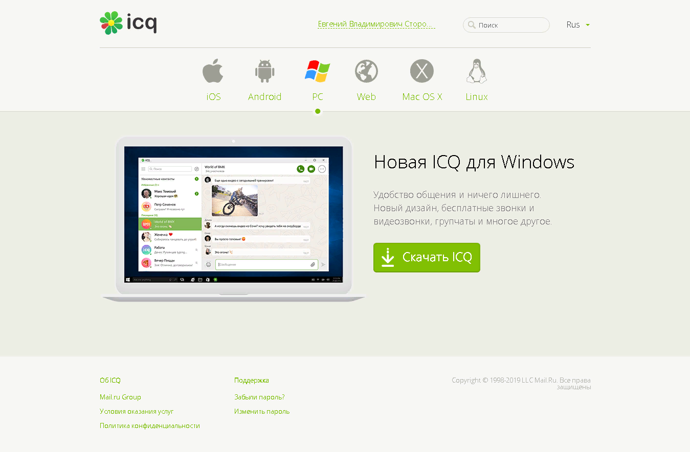
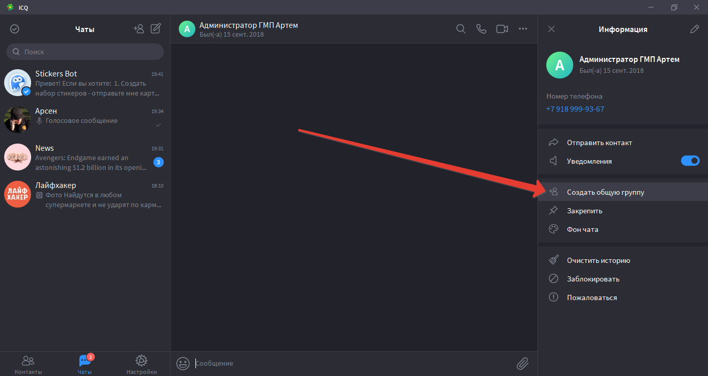

В очередной раз наткнувшись в сети на сообщения о том что Роскомнадзор обратил свой взор еще и не  Whatsaap и Viber, помимо Telegram, я задумался над поиском программы которая сможет их заменить. К сожалению,  заменить Телеграмм в настоящий момент нечем, ни одна программа из знакомых мне не обладает такой дичайшей функциональность.

Так вот, для меня было удивительным узнать что старая добрая тёплая и ламповая аська незаметно догнала их по общей функциональности.  Есть версии для носимых и настольных вычислителей, с личными и групповыми чатами, бесплатными голосовыми и видеозвонками, каналами для подписчиков и стикерами. А также  в видеозвонках  поддерживаются анимированные 3D-мас. С 2010 года icq один из трёх программ обмена сообщениями принадлежащих Mailru Group. наравне с Mail.ru Agent и ТамТам. И ежедневная аудитория составляет больше 11 миллионов пользователей (не только русскоязычных). Давайте посмотрим поближе!

Как видно из скриншота главной страницы сайта клиентские программы есть под все основные платформы, как носимых, так и настольных вычислителей. Что для меня оказалось приятным сюрпризом, клиент под Linux распространяется по Apache Public License 2.0 и исходные коды лежат на Github. Что лично для меня является жирным плюсом, при том что сам протокол и сервера остаются проприетарными и недоступными для изучения.

Себе поставил сразу два клиента, на ноут с Windows 10, с которого и пишу этот текст, и на мобильник под Андройдом из магазина Google Play. Авторизация может проходить как через старый UIN и электронную почту, так и через номер мобильного телефона. Тут пригодился намертво вбитый в память 8-ми значный номер =) Всё работает, как и 20 лет назад, контакт лист подтянулся нормально, даже с группами (хотя для официального клиентского приложения это неактуально).

Восстановил пароль, он пришёл на привязанную почту. Кстати при восстановлении пароля принудительно привязывается номер телефона к аккаунту.

В клиенте для носимого вычислителя под Андройдом есть кнопка Каналы, в настольном приложении нет. В результате, читать можно, а искать подписываться нельзя. Странное разделение функционала. Канылы, очень похожи на Телеграм. Нужно теперь узнавать, что там с ботами. Если они есть, то это же ого-го!

С передачей файлов все наоборот. На клиенте для носимых вычислителей я скрепочку для отправки файлов не обнаружил, только иконку камеры для отправки видео и фото. А вот на настольном клиенте, только скрепочка и есть в инструментах чата.
Чтобы отправить голосове сообщение нужно сначала выбрать метод ввода, а потом нажать и удерживать кнопку для записи сообщения. Зато сообщение можно распознать в текст. Что очень удобно и страшно бесила в Whatsup-е необходимость прослушивать голосовые сообщения, что не всегда удобно. Особенно когда их в чате много.

Стикеры есть разные. Можно загрузить стакеры из Телеграма. Или создавать свои. Для этого нужно Stikers боту отправить картинку, в том числе и gif. Опять же функционал есть только в клиенте для носимых вычислителей. Сам стикерами не пользуюсь, но многим это важно.

Безопасность. Есть возможность блокирования экрана. В состав клиента зачем-то входит OpenSSL уж не для шифрования соединений с сервером ли? Потому как функционала защищенных чатов я не нашёл.

Рассылку сообщения сразу нескольким адресатам сделать не получилось? только переслать полученное сообщение. Ограничения на количество получателей отсутствует. Так что поздравительные штормы сообщений создавать не очень удобно. Конечно, можно создать группу в которой будут все контакты и создать сообщение в ней. Но как-то это очень криво.

**Вывод:  Думаю можно переходить. Функцонал уже достаточен для повседневного использования. С учётом всяких непонятностей с блокировками. Хранением Персональных данных на территории РФ и прочими законодательными вывертами в виде автономного интернета, то лучше переходить на "отечественные" сервисы. Ностальгия при звуке "А-ау" - бесценно.**