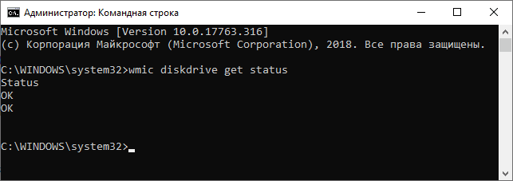
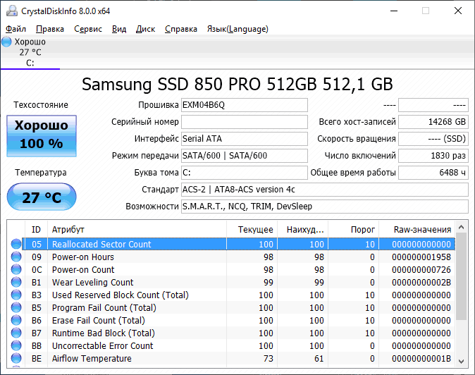
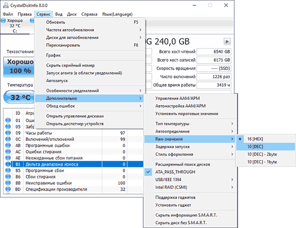

Проверка SSD на ошибки — не то же самое, что аналогичные тесты обычных жестких дисков и многие привычные вам средства здесь по большей части не подойдут в связи с особенностями работы твердотельных накопителей.

В этой инструкции подробно о том, как проверить SSD на ошибки, узнать его состояние с помощью технологии самодиагностики S.M.A.R.T., а также о некоторых нюансах выхода диска из строя, которые могут быть полезны.

# Встроенные средства проверки дисков Windows 10, 8.1 и Windows 7
Для начала о тех средствах проверки и диагностики дисков Windows, которые применимы к SSD. В первую очередь речь пойдет о CHKDSK. Многие используют эту утилиту для проверки обычных жестких дисков, но насколько она применима к SSD?

В некоторых случаях, когда речь идет о возможных проблемах с работой файловой системы: странное поведение при действиях с папками и файлами, «файловая система» RAW вместо ранее рабочего раздела SSD, вполне можно использовать chkdsk и это может быть эффективным. Путь, для тех, кто не знаком с утилитой, будет следующим:

1. Запустите командную строку от имени администратора.
2. Введите команду chkdsk C: /f и нажмите Enter.
3. В команде выше букву диска (в примере — C) можно заменить на другую.
4. После проверки вы получите отчет о найденных и исправленных ошибках файловой системы.

В чем особенность проверки SSD по сравнению с HDD? В том, что поиск поврежденных секторов с помощью дополнительного параметра, как в команде chkdsk C: /f /r производить не нужно и бессмысленно: этим занимается контроллер SSD, он же переназначает сектора. Аналогично, не следует «искать и исправлять бэд-блоки на SSD» с помощью утилит наподобие Victoria HDD.

Также в Windows предусмотрен простой инструмент для проверки состояния диска (в том числе SSD) на основании данных самодиагностики SMART: запустите командную строку и введите команду wmic diskdrive get status

В результате её выполнения вы получите сообщение о статусе всех подключенных дисков. Если по мнению Windows (которое она формирует на основании данных SMART) всё в порядке, для каждого диска будет указано «Ок».

# Программы проверки SSD дисков на ошибки и анализа их состояния

Проверка ошибок и состояния SSD накопителей производится на основании данных самодиагностики S.M.A.R.T. (Self-Monitoring, Analysis, and Reporting Technology, изначально технология появилась для HDD, где применяется и сейчас). Суть в том, что контроллер диска сам записывает данные о состоянии, произошедших ошибках и другую служебную информацию, которая может служить для проверки SSD.

Есть множество бесплатных программ для чтения атрибутов SMART, однако начинающий пользователь может столкнуться с некоторыми проблемами при попытке разобраться, что значит каждый из атрибутов, а также с некоторыми другими:

Разные производители могут использовать разные атрибуты SMART. Часть из которых попросту не определена для SSD других производителей.
Несмотря на то, что вы можете ознакомиться со списком и объяснениями «основных» атрибутов S.M.A.R.T. в различных источниках, например на Википедии: https://ru.wikipedia.org/wiki/S.M.A.R.T, однако и эти атрибуты по-разному записываются и по-разному интерпретируются различными производителями: для одного большое число ошибок в определенном разделе может означать проблемы с SSD, для другого — это просто особенность того, какие именно данные туда записываются.
Следствием предыдущего пункта является то, что некоторые «универсальные» программы для анализа состояния дисков, особенно давно не обновлявшиеся или предназначенные в первую очередь для HDD, могут неверно уведомлять вас о состоянии SSD. Например, очень легко получить предупреждения о несуществующих проблемах в таких программах как Acronis Drive Monitor или HDDScan.
Самостоятельное чтение атрибутов S.M.A.R.T. без знания спецификаций производителя редко может позволить обычному пользователю составить правильную картину о состоянии его SSD, а потому здесь используются сторонние программы, которые можно разделить на две простые категории:

**CrystalDiskInfo** — самая популярная универсальная утилита, постоянно обновляющаяся и адекватно интерпретирующая атрибуты SMART большинства популярных SSD с учетом информации производителей.
**Программы для SSD от производителей** — по определению знают все нюансы содержимого атрибутов SMART твердотельного накопителя конкретного производителя и умеют правильно сообщить о состоянии диска.

Если вы — рядовой пользователь, которому требуется просто получить сведения о том, какой ресурс SSD остался, в хорошем ли он состоянии, а при необходимости и автоматически произвести оптимизацию его работы — я рекомендую обратить внимание именно на утилиты производителей, которые всегда можно скачать бесплатно с их официальных сайтов (обычно — первый результат в поиске по запросу с названием утилиты).

**Samsung Magician** — для SSD Samsung, показывает состояние диска на основании данных SMART, количество записанных данных TBW, позволяет просмотреть атрибуты напрямую, выполнить настройки диска и системы, обновить его прошивку. 
**Intel SSD Toolbox** — позволяет произвести диагностику SSD от Intel, просмотреть данные о состоянии и произвести оптимизацию. Отображение атрибутов SMART доступно и для дисков других производителей. Утилита Intel SSD Toolbox
**Kingston SSD Manager** — сведения о техническом состоянии SSD, оставшийся ресурс по разным параметрам в процентах. Kingston SSD Manager
**Crucial Storage Executive** — оценивает состояние как для SSD Crucial, так и других производителей. Дополнительные возможности доступны только для фирменных накопителей. Утилита для SSD Crucial Storage Executive
**Toshiba / OCZ SSD Utility** — проверка состояния, настройка и обслуживание. Отображает только фирменные накопители.
**ADATA SSD Toolbox** — отображает все диски, но точные данные о состоянии, в том числе оставшемся сроке службы, количестве записанных данных, проверить диск, выполнить оптимизацию системы для работы с SSD. Программа ADATA SSD Toolbox
**WD SSD Dashboard** — для дисков Western Digital.
**SanDisk SSD Dashboard** — аналогичная утилита для дисков

В большинстве случаев указанных утилит оказывается достаточно, однако, если ваш производитель не позаботился о создании утилиты проверки SSD или есть желание вручную разобраться с атрибутами SMART, ваш выбор — CrystalDiskInfo. Однако существуют и более простые утилиты, позволяющие, к примеру, получить информацию об ожидаемом сроке службы SSD диска, например, [SSDLife](https://ssd-life.ru/).

# Как пользоваться CrystalDiskInfo
Скачать CrystalDiskInfo можно с официального сайта разработчика https://crystalmark.info/en/software/crystaldiskinfo/ — несмотря на то, что установщик на английском (доступна и portable версия в ZIP-архиве), сама программа будет на русском языке (если он не включится сам, измените язык на русский в пункте меню Language). В этом же меню вы можете включить отображение названий атрибутов SMART на английском (как они указаны в большинстве источников), оставив интерфейс программы русскоязычным.

Информация SMART в CrystalDiskInfo
Что дальше? Дальше вы можете ознакомиться с тем, как программа оценивает состояние вашего SSD (если их несколько — переключение в верхней панели CrystalDiskInfo) и заняться чтением атрибутов SMART, каждый из которых, помимо названия, имеет три столбца с данными:

**Текущее (Current)** — текущее значение атрибута SMART на SSD, обычно указывается в процентах оставшегося ресурса, но не для всех параметров (например, температура указывается иначе, с атрибутами ошибок ECC та же ситуация — кстати, не паникуйте, если какой-то программе не понравится что-то связанное с ECC, часто дело в неверной интерпретации данных).
**Наихудшее (Worst)** — худшее зарегистрированное для выбранного SSD значение по текущему параметру. Обычно совпадает с текущим.
**Порог (Threshold)** — порог в десятичной системе счисления, при достижении которого состояние диска должно начать вызывать сомнения. Значение 0 обычно говорит об отсутствии такого порога.
**RAW-значения (RAW values)** — данные, накопившиеся по выбранному атрибуту, по умолчанию отображаются в шестнадцатеричной системе счисления, но можно включить десятичную в меню «Сервис» — «Дополнительно» — «RAW-значения». По ним и спецификациям производителя (каждый может по-разному записывать эти данные) вычисляются значения для столбцов «Текущее» и «Наихудшее». Включение десятичного отображения для RAW в CrystalDiskInfo

А вот интерпретация каждого из параметров может быть разной для разных SSD, среди основных, которые доступны на разных накопителях и легко читаются в процентах (но в RAW-значениях могут иметь разные данные) можно выделить:
**Reallocated Sector Count** — количество переназначенных блоков, тех самых «бэд-блоков», о которых шла речь в начале статьи.
**Power-on Hours** — время наработки SSD в часах (в RAW-значениях, приведенных к десятичному формату, обычно указываются именно часы, но не обязательно).
**Used Reserved Block Count** — количество использованных резервных блоков для переназначения.
**Wear Leveling Count** — процент износа ячеек памяти, обычно считается на основании количества циклов записи, но не у всех марок SSD.
**Total LBAs Written, Lifetime Writes** — количество записанных данных (в RAW значениях могут блоки LBA, байты, гигабайты).
**CRC Error Count** — выделю этот пункт среди прочих, потому как при нулях в других атрибутах подсчета разных типов ошибок, этот может содержать какие-либо значения. Обычно, всё в порядке: эти ошибки могут накапливаться при внезапных отключениях питания и сбоях ОС. Однако, если число растет само по себе, проверьте, чтобы ваш SSD был хорошо подключен (не окисленные контакты, плотное подключение, исправный кабель).

Если какой-то атрибут не ясен, отсутствует в Википедии (ссылку приводил выше), попробуйте просто выполнить поиск по его названию в Интернете: вероятнее всего, его описание будет найдено.

В заключение одна рекомендация: при использовании SSD для хранения важных данных, всегда имейте их резервную копию где-либо ещё — в облаке, на обычном жестком диске, оптических дисках. К сожалению, с твердотельными накопителями актуальна проблема внезапного полного выхода из строя без каких-либо предварительных симптомов, это нужно учитывать.