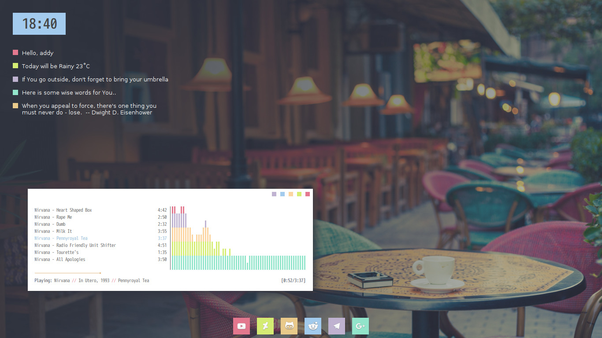
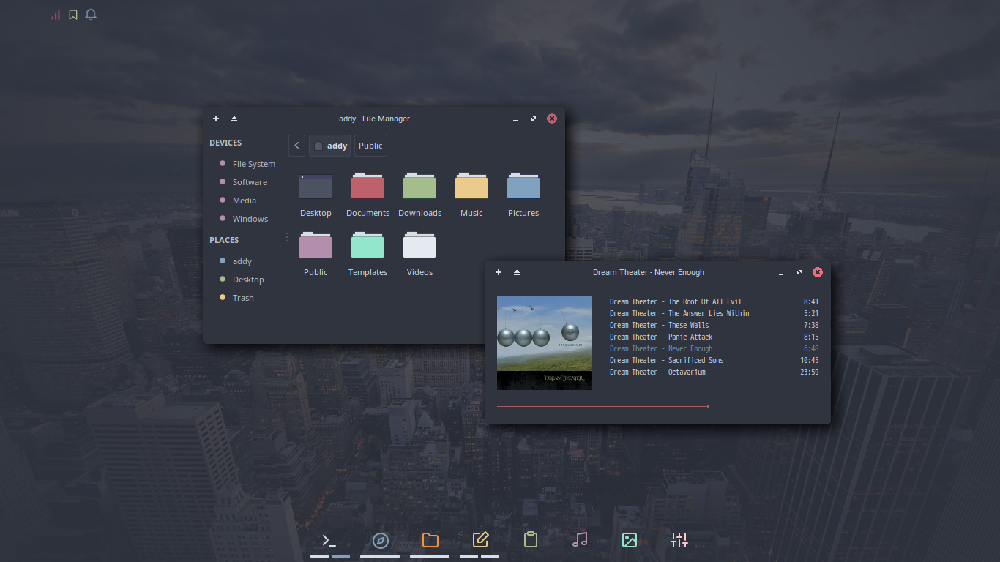

Дано: Установленная сисема Debian 10 XFCE4.14.
Требуется: Установить и настроить более легковесный менеджер окон Openbox

Оставлю за скобками выбор OpenBox вкачестве WM. Оснований для выбора в общем-то каки-то нет. Ткнул пальцем в первый попавшийся, два часа порывшись в Сети.

За цель приму что-то вроде таких вариантов:

Начну с уточнения требований. Моя машина стоит дома и на ней нет ничего, что стоило бы защищать. Даже таким примитивным образом как пароль. Поэтому при включении машины  должен происходить автологон в систему.  Я использую графический менеджер LightDM, поэтому у меня всё свелось к изменению трёх строчек в его конфигураионном файле \etc\lightdm\lightdm.conf:
> autologin-user=kpa39l
> autologin-user-timeout=0
> user-session=openbox
Кстати, в документации из Сети имя сессии для OpenBox часто указывается как openbox-session, а вот Debian 10 есть тонкость. Если выполнить команду  **ls /usr/share/xsessions/** то отобразятся все доступные сессии установленных DE и WM.

На этом этапе имеем,что привключении компьютера после процесса загрузки сразу попадаем на рабочий стол. Гденет ничего кроме курсора мыши. Щелчок правой кнопкой мыши вызывает меню. Все.

Самое время немного поиграться сустановленными obconf и obmenu.

Дальше ставим **tint2** - панель со списком запущенных программ, часами, трей-зоной и даже можно аналог quicklaunch из Windows организовать. Вот так это выглядит у меня:

Для отключения графического входа в систему вводим команду:
> systemctl set-default multi-user.target
Для включения обратно:
> systemctl set-default graphical.target
посмотреть текущее состояние:
> systemctl get-default
Если в ответе будет **graphical.target**, то графическая оболочка включена и **multi-user.target**, если выключена.

Источники:
https://ru.wikipedia.org/wiki/Openbox
http://openbox.org/wiki/Help:Getting_started#Using_Openbox_without_a_desktop_environment_.28The_lightweight_approach.29
https://wiki.debian.org/ru/Openbox
http://itnotesblog.ru/note.php?id=208
https://losst.ru/luchshie-temy-dlya-openbox
https://github.com/addy-dclxvi/Openbox-Theme-Collections
https://qiwichupa.net/debian-10-buster-openbox-ustanovka-i-nastrojka
https://blackdiver.net/it/linux/4043
https://oposumo.livejournal.com/51878.html